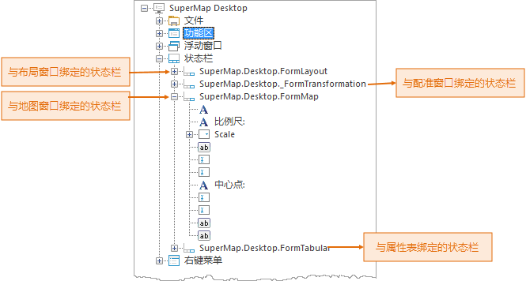

工作环境设计窗口的结构区中，根结点下的显示名称为“状态栏”的子结点，其子结点对应着应用程序中的所有可定制的状态栏，应用程序中的状态栏是显示在特定的窗口中的，因此，结构区中状态栏对应结点的显示名称为该状态栏所绑定的窗口对应的窗口类名称。
状态栏结点的子结点为放置在该状态栏中的控件对应的结点。

应用程序主要提供了四种状态栏：与地图窗口绑定的状态栏，即在地图窗口底部显示的状态栏；与配准窗口绑定的状态栏，即在配准窗口底部显示的状态栏；与布局窗口绑定的状态栏，即在布局窗口底部显示的状态栏；与属性表窗口绑定的状态栏，即在属性表窗口底部显示的状态栏。

结构区中对应状态栏上的界面元素的结点，其结点的显示名称为该界面元素在界面上所显示的名称。

  
