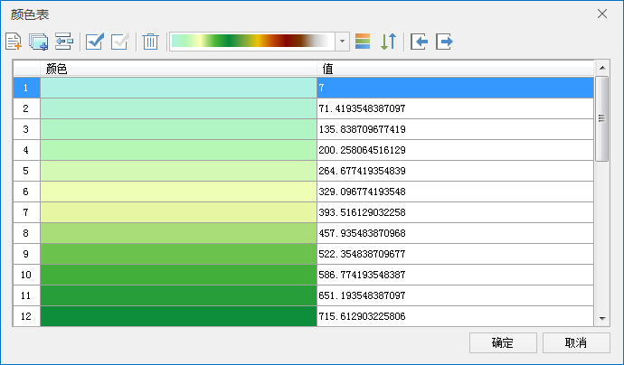

  ---
  id: ColorTableDia
  title: 颜色表设置对话框
  ---
  **颜色表:** 栅格数据的颜色表用来设置栅格数据中像元的显示颜色。
  颜色表指定了一系列的像元值对应的颜色，即该像元值对应像元的显示颜色，而栅格数据中其他没有指定颜色的像元，将根据其像元值大小在颜色表中被指定了颜色的像元值所构成的数值序列中的位置来自动赋予其颜色值，即通过已指定颜色的像元值来对栅格数据中所有像元值进行分段，没有指定颜色的像元根据其数值所处的分段范围获得显示颜色。

  ### 颜色表设置对话框说明

  颜色表设置对话框如下图所示，用户可通过该对话框设置栅格图层中的栅格数据的颜色方案，或者设置某个像元值所使用的颜色；也可以通过添加新的像元值，或者删除部分像元值来调整栅格数据的显示方案。

    

  **列表框说明**

  * 序号:显示了颜色表中的颜色序号，该序号是自动生成的，不能更改。
  * 颜色：表示该像元值对应的像元所显示的颜色，单击该字段中的单元格，弹出颜色对话框，可以在这里选择和设置某种颜色来改变对应像元值的显示颜色。
  * 值：表示像元值。用户可以对颜色字段进行编辑： 单击该字段的某个单元格，当再次单击鼠标时，该单元就变为可编辑状态。此外，单击颜色字段名称可对颜色字段进行排序。

  **工具条说明**

  * ：单击“添加”按钮，弹出默认色板，将选择的颜色，添加到颜色表列表框的最后面。
  * ：单击“批量添加”按钮，弹出“批量添加”对话框（如下图所示），    
  ---  
    * 起始值：批量添加像元值的起始数值。
    * 终止值：批量添加像元值的终止数值。
    * 步长：批量添加的具体像元值为从“起始值”开始，以“步长”递增，直到“终止值”为止。
    * 级数：添加多少级，通过‘（“终止值”-“起始值”）/ 级数’来获得步长。

  步长和级数两者只能设置其一，二者不能同时可用。

    * 自动重新计算终止值：此参数需要与步长配合使用。根据设置的步长，自动重新计算终止值。有些情况下，设置的终止值不太合适，导致[（终止值-起始值）/步长] 计算获得的结果不为整数，需要对终止值进行修正。例如起始设置为150，终止值为1002，步长为100，自动计算终止值的情况下，颜色表中显示的终止值为950，而不是1002。
  * 单击“插入”按钮，弹出默认色板，将选择的颜色，添加到颜色表列表框中选中的记录的前面。
  * 单击“全选”按钮，用来选中列表框中的所有记录。 
  * 单击“反选”按钮，用来反向选择列表框中的记录，即原来没有被选择的记录变为选中状态；原来选中的记录变为非选中状态。
  * 单击“删除”按钮，用来删除列表框中选中的记录。
  * 单击“颜色方案”按钮右侧的下拉箭头，选择颜色表要使用的颜色方案。注意：当选中列表中2条及以上的记录时，仅对选中的记录的颜色方案进行修改。
  * 单击“默认颜色方案”按钮，将当前的颜色方案设置为默认颜色方案。注意：当选中列表中2条及以上的记录时，仅会将选中的记录的颜色方案重置为默认颜色方案。
  * 单击“颜色反序”按钮，将颜色方案按照相反的顺序进行调整，即将颜色方案中的各个颜色位置进行反序排列，重新形成新的颜色表。注意：当选中列表中2条及以上的记录时，仅会将选中的记录的颜色方案进行反序处理。
  * 单击“导入颜色表”按钮，可以将外部的颜色表导入到当前列表框中。关于如何导入颜色表，请参见[导入导出颜色表](../../Analyst/Raster/SurfaceAnalyst/ImportExport.html#1)页面的介绍内容。
  * ：单击“导出颜色表”按钮，可以将当前颜色表导出。关于如何导入颜色表，请参见[导入导出颜色表](../../Analyst/Raster/SurfaceAnalyst/ImportExport.html#2)页面的介绍内容。

