### 旋转角度

旋转角度:标签控件用来设置当前地图窗口中地图的旋转角度。用户可输入 [-360, 360
]范围内的任意数值，单位为度，精度到0.1度，正值代表地图沿逆时针方向旋转，负值代表地图沿顺时针方向旋转。当用户输入完角度值后，当前地图会即时按照指定的角度值进行旋转。

当前地图进行旋转时，每一次旋转操作都是相对于原始状态的地图进行的，即没有进行任何旋转操作时的地图。旋转的基点为地图在当前地图窗口中可视范围的中心点。同时，地图旋转的操作不会改变地图中各个图层对应的数据。

### 颜色模式

程序为地图提供了几种预设的颜色模式，可设置当前地图窗口中所有矢量数据集的颜色模式，提供的颜色模式有默认色彩模式、黑白模式、灰度模式、黑白反色模式、黑白反色
其他颜色不变五种，设置后可即时预览地图的输出效果。

  
---  

### 背景颜色

支持设置地图的背景颜色，单击右侧控件或下拉按钮，将弹出颜色面板，可以选择提供的默认颜色也可以点击颜色面板底部的“其他颜色”按钮自定义颜色，地图的背景色会即时应用当前设置的颜色。

### 显示设置

地图属性中的“显示设置”包括点、线、面符号及文本标签的显示优化设置，具体的参数说明如下所述：

* **文本最小/最大尺寸** :用于设置当前地图中显示的文本对象的最小尺寸和最大尺寸，单位为 mm。当地图中文本对象的字体高度小于指定的最小尺寸或大于最大尺寸时，文本字体均不显示。当进行地图放大缩小浏览时，文本对象的字体大小会随之放大或者缩小，但是当放大或缩小到一定程度时，文本的显示可能会失去实际意义，因此，可使用这两个组合框控件设置当前地图中文本对象的可视状态。
* **最大可见节点数** :用于设置当前地图中可以显示的节点最大数目，若当前地图窗口中几何对象的节点数超过了指定的最大可见节点数，则这个几何对象将不可见。
* **显示压盖对象**

当地图中放置多个标注要素时，且地图比例尺较小时，就会出现文本、标签、专题图元素等显示过于密集的区域，这些要素之间会会出现相互压盖的现象，从而减低地图的可读性。压盖设置功能帮助用户对地图中的文本、标签、专题图元素等对象的显示进行控制，有利于更好地处理地图中各种类型对象的压盖显示问题，最终获得比较满意的地图显示效果。

若选择“显示被压盖对象”复选框，则当地图中文本对象出现压盖现象时，不进行过滤处理，显示全部文本对象。若不勾选“显示压盖对象”复选框，则地图会根据文本对象在地图上的压盖情况，自动过滤掉后输入的文本对象，从而避免压盖现象出现。显示压盖对象的功能不仅适用于地图中的文本对象，还适用于专题图中的专题元素，即当专题元素之间出现压盖现象时，也可通过该复选框控制是否进行处理。

**压盖设置选项**

可以对不同类型的压盖对象之间的显示进行控制。发生压盖的对象既可以位于同一个图层，也可以来自于不同图层。注意：当两个对象发生叠置时，在设置了显示压盖对象的情况下，我们会优先显示位于下方的被压盖的对象，位于上方的对象将不会显示。

* **点随标签显隐**

如果点图层中的点比较密集，对其制作标签专题图，则标签专题图的自动避让功能会将压盖重叠的标签自动避让掉，这样就形成个别点没有标签的错觉；如果不使用自动避让又会出现标签之间压盖的情况产生。点随标签显隐功能控制点图层和基于该图层制作的标签专题图的标签的过滤显示问题。选中"点随标签显隐"复选框，如果点对应的标签被隐藏掉的话，则该点也不会显示。

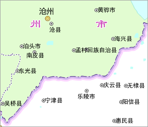 | 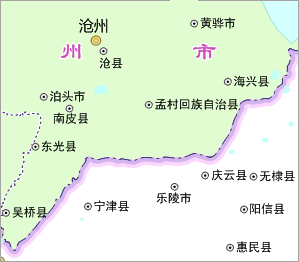  
---|---  
未使用点随标签显隐过滤压盖对象 | 使用点随标签显隐过滤压盖对象  
* **显示被点压盖的点**

当地图中同一图层中的点对象或者不同点图层的点对象被其它点对象压盖时，可以控制是否显示相互压盖的点对象。选中此项表示将同时显示显示发生压盖的点对象，否则仅显示位于下方的点对象，位于上方的点对象不会显示。

* **显示点和文本相互压盖的对象**

文本包含标签专题图的文本注记和文本图层（CAD图层）的文本。当地图中的点图层和标签专题图或文本图层（CAD
图层）发生压盖现象时，可以控制显示相互压盖的对象与文本（包括标签）的显示情况。选中此项表示显示发生叠置的点和文本对象；否则仅显示位于下方的点或者文本对象，叠置于其上的对象将不会显示。注意：此项不能控制文本对象之间的压盖和点对象之间的压盖。

如下图所示，左图为原始地图，默认选中“显示点和文本相互压盖的对象”压盖选项；右图是不显示发生压盖的点与文本对象的效果。由于标签图层（文本）位于点图层之上，所以一旦点与文本对象发生叠置时，选择“显示点和文本相互压盖的对象”复选框时，文本对象将被过滤掉，仅保留点对象。

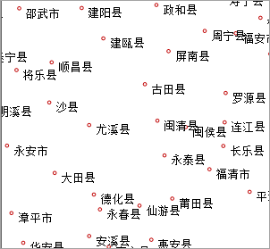 | 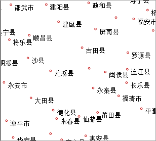  
---|---  
显示点与文本相互压盖的对象 | 不显示点与文本相互压盖的对象  
* **显示被文本压盖的文本**

文本包含标签专题图的文本注记和文本图层（CAD图层）的文本。当标签专题图图层或文本图层（CAD
图层）中的文本或者标签之间发生叠置时，可以使用“显示被文本压盖的文本”项对其压盖情况进行控制。选中“显示被文本压盖的文本”复选框，对发生叠置的文本对象不作处理，即全部显示叠置的文本对象；否则，对叠置的对象进行显示控制，即位于下方的对象保留，而叠置于其上的对象将被不会显示。注：在标签专题图图层中会先判断是否执行“自动避让”功能。

如下图所示，左图为原始地图，选中了“显示被文本压盖的文本”选项，全部显示叠置的文本对象；右图未选中“显示被文本压盖的文本”选项，仅显示位于下方的文本对象，而与其发生叠置的文本对象不会显示。

 | 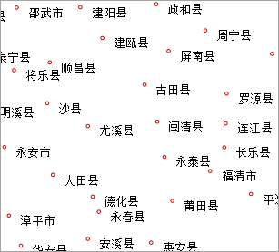  
---|---  
显示被文本压盖的文本 | 不显示被文本压盖的文本  
* **显示被压盖的等级符号**

统计符号专题图中的等级符号之间很有可能发生压盖，这些叠置的对象可以来自一个或者多个图层。通过“显示被压盖的等级符号”选项设置参数，可以对发生压盖的等级专题图元素显示情况进行控制。选中该复选框，不会进行显示控制，显示所有发生叠置的等级符号；否则会对叠置的对象进行过滤，即仅显示下方的对象，不会显示位于其上的对象。

* **显示被压盖的统计符号**

如果地图中的统计符号专题图（如饼图和柱状图）图层的统计符号之间可能会发生压盖，这些统计符号可以存在于一个图层或者多个图层。通过压盖设置菜单中的“显示被压盖的统计符号”选项，可以对相互叠置的统计符号的显示情况进行控制。选中该复选框，则不会对统计符号的显示进行控制，显示所有叠置的统计符号；否则仅显示位于下方的统计符号对象，不显示位于其上的统计符号对象。

**压盖范围设置**

“压盖范围”用来设置两个对象之间的压盖间距，通过指定宽度和高度来确定此范围。例如设置压盖范围的宽和高分别为60和40，则实际的压盖范围计算方法是以文本对象的外接矩形为边界，向左向右60个单位，向上向下40个单位。单位为0.1mm。压盖范围对以上5种压盖情况均适用。

压盖间距（压盖范围的宽或高）为正数时表示两个对象之间的距离，超出该距离时显示，小于等于该距离时不显示；为负数时表示两个对象的压盖距离，小于该距离的绝对值时显示，大于等于该距离的绝对值时不显示。

如下图所示，左图没有设置压盖范围，应用程序根据前面设置的过滤选项对文本的显示进行控制，右图所示设置压盖范围（宽为20 mm，高为20
mm）的显示效果，应用程序对落入每个文本此范围内的其他对象进行过滤处理。

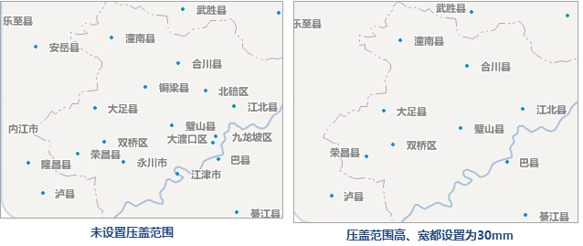  
---  
* **固定符号角度** ：适用于固定地图中的点符号角度，勾选该复选框之后，当前地图窗口中点状符号的角度固定，即当地图旋转时，地图中的点状符号不随地图进行旋转；若不勾选该复选框，则地图中的点状符号角度不固定，地图旋转时点状符号也随之进行旋转。**注意**：只有设置了地图的旋转角度为非 0 值时，该复选框才可用。
* **固定文本角度** ：若勾选“固定文本角度”复选框，表示当前地图窗口中文本对象的角度固定，即当地图旋转时，地图中的文本对象不随地图的旋转而旋转；如若不勾选该复选框，则地图中文本对象的角度不固定，地图旋转时，文本对象也随之进行旋转。注意：只有设置了地图的旋转角度为非 0 值时，该复选框才可用。
* **固定文本方向** ：若勾选“固定文本方向”复选框，表示当前地图窗口中文本对象的总是竖直显示（如下图所示）。当文本方向固定时，无论文本角度如何变化，文本都竖直显示。  

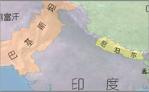|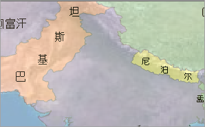  
---|---  
未勾选“固定文本方向”复选框的显示效果| 勾选“固定文本方向”复选框的显示效果  
* **文本反走样** ：文本反走样是指使地图中文本笔画趋于平滑，消除锯齿的显示效果，启用文本反走样之后，可优化文本在地图中的显示效果。注意：需同时开启地图反走样和图层反走样，才可生效。  

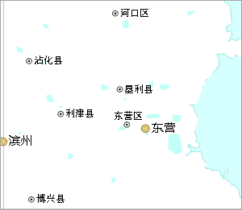 | 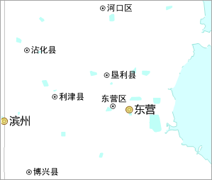  
---|---  
设置文本反走样前

| 设置文本反走样后  

* **线型反走样** ：线型反走样是指使地图中矢量数据集的线条平滑，消除锯齿的显示效果。启用线型反走样之后，可优化线型对象在地图中的显示效果。注意：需同时开启地图反走样和图层反走样，才可生效。

* **兼容 Office 字体大小**

SuperMap 地图中的字体显示大小与 Micorsoft Office 字体大小不同，地图中相同字号的文本，SuperMap 显示标准要比
Micorsoft Office 标准的字体显示小。在“ **地图属性** ”面板中，勾选“兼容 Office
字体大小”复选框，即开启字体兼容模式，地图中的文本将按照 Micorsoft Office 标准大小显示字体；若不勾选该复选框，则依照 SuperMap
字体大小标准显示。

新建地图窗口时，默认开启字体兼容模式，打开用 SuperMap iDesktop 7C(V7.1)
之前版本保存的地图时，则默认不勾选该复选框，用户可根据需要勾选“兼容 Office 字体大小”选项。

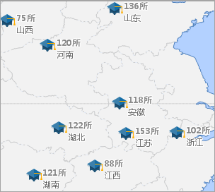 | 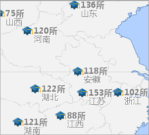  
---|---  
开启兼容 Office 字体大小前 | 开启兼容 Office 字体大小后  

* **Alpha通道**

开启地图 Alpha 通道后，图层颜色设置的 A
值即可生效，从而使地图中的要素达到透明或半透明的效果，同时，支持输出半透明效果的地图。支持设置Alpha通道的图层有：矢量图层、专题图图层、文本图层。

* **可用于调整同一色系的颜色**

在“ **地图属性**
”面板中勾选“Alpha通道”复选框之后，设置点线面标签等图层颜色时，不仅可以设置RGB值，还可设置A值（即Alpha值）。如下图所示：

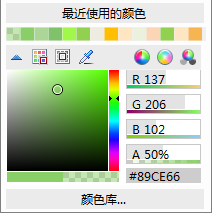  
---  

相同的RGB值设置不同的Alpha值之后，可衍生出多种同色系的颜色，如下图所示，设置绿地颜色的RGB为（137,206,102）值，调整不同的颜色透明值（Alpha值）后，绿地的颜色不同。

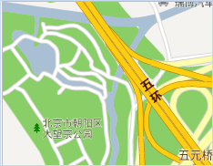 | 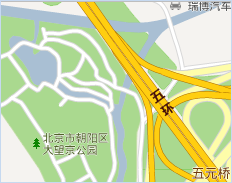 |   
---|---|---  
未设置A值 | 设置A值为70% | 设置A值为30%  
* **制作半透明地图**

在实际应用中，有时需要图层中某个图斑做透明处理，从而使该区域下面的要素显示出来；或者，不希望地图中的某些要素完全遮挡其下叠加的要素。可通过设置Alpha值来实现半透明效果，满足这些应用需求。

例如，一些关于范围的地理空间分析结果，与地图叠加，可以对分析结果的图斑设置半透明效果，从而更直观清晰的展示分析范围内的地物内容，便于从视觉上详细描述分析结果。下图为服务区分析结果与地图叠加，设置分析结果范围为半透明效果，从而清晰的反应出所覆盖范围内的地物状况：

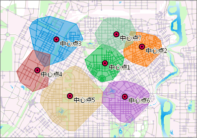  
---  
服务区半透明显示  
* **支持半透明出图**

8C以前的版本在输出地图时，不支持透明或半透明的地图输出，该情况常应用于地图缓存的输出，输出的瓦片背景透明，这样的地图缓存就可以很好地与其他地图内容进行叠加显示，下图为输出背景透明的地图缓存与卫星影像地图叠加显示图：

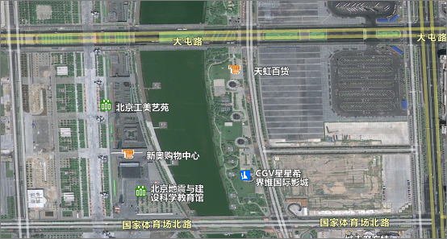  
---  
道路与卫星影像图叠加显示  

### 注意事项

* 设置场景中图层颜色或属性表背景颜色的 A 值，可直接生效，与地图属性面板中的 Alpha 通道是否开启无关。

* * *

  

---

