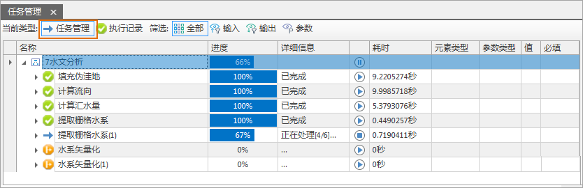
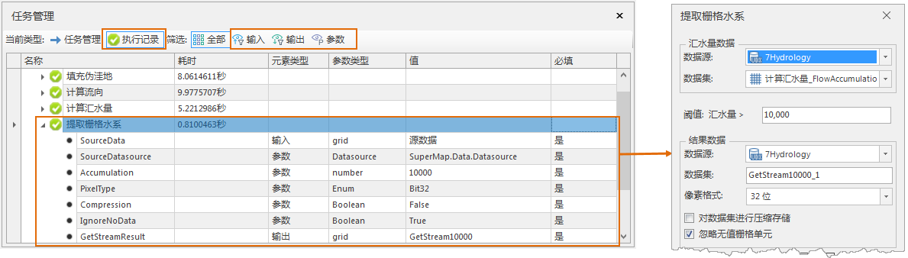

地理处理建模的任务管理，可实时查看模型各任务执行的进度与状态，以及历史执行记录的详细信息，包括输入、输出和参数设置等，便于追溯模型执行情况。

任务管理器支持查看 **任务管理** 和 **执行记录** 两种类型，以下对两种类型进行详细介绍。

###  任务管理

在任务管理中 **任务管理** 面板中可实时查看模型中所有执行任务的详细信息，具体信息如下：

  * **名称** ：显示模型名称及模型中的各任务名称。
  * **进度** ：实时显示模型执行的进度条。
  * **详细信息** ：实时显示各任务执行的流程状态信息，可分为等待、正在执行、已完成、执行失败等状态类型；
    * **等待（...）** ：显示当前模型中待执行的任务，如下图中的“水系矢量化”；
    * **正在执行** ：显示当前正在执行的功能，如下图中的“提取栅格水系(1)”。
    * **已完成** ：显示当前模型中已执行成功的任务，执行完后，地理处理建模窗口中会在该功能的右上角显示“√”。
    * **执行失败** ：显示当前模型中执行失败的任务，此时地理处理建模窗口中会在该功能的右上角显示“×”，在建模窗口中双击该功能，修改其参数后，可再次运行。
  * **执行/暂停** ：单击“执行”“暂停”“停止”按钮，可分别启动、暂停、停止当前任务的执行。
  * **耗时** ：显示当前任务执行的耗费时间。

  

  
###  执行记录

在任务管理面板中 **执行记录** 面板可查看模型中历史执行记录的详细信息，包括输入、输出和参数设置等，具体信息如下：

  * **元素类型** ：支持查看输入、输出、参数等三类信息，可在面板中单击对应按钮进行筛选查看。 
    * **输入** ：即为当前执行功能中设置的输入数据，如下图所示以“提取栅格水系”功能为例，输入数据为计算汇水量的结果数据，为栅格数据，“ **参数类型** ”为“grid”，是必填参数。
    * **输出** ：即为当前执行功能中设置的输出数据，如下图所示以“提取栅格水系”功能为例，输出数据为提取水系的结果数据为“GetStrea10000”，“ **参数类型** ”为“grid”，是必填参数。
    * **参数** ：即为当前执行功能中除去输入和输出数据以外的参数，如下图所示以“提取栅格水系”功能为例，参数包含“阈值”、“像素格式”、“对数据集进行压缩存储”、“忽略无值栅格单元”等参数，在“ **值** ”列中显示的即为具体参数的值。

  

  
### 相关内容

 [地理处理建模概述](WorkFlowSummarize.html)

 [基本词汇](WFConcepts.html)

 [基本操作](WFBasicOperation.html)

 [创建模型](CreatWorkFlow.html)

 [模型模版](WorkFlowTemplate.html)

 [地理处理建模实例](WorkFlowApplications.html)

