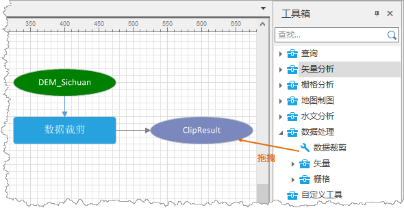
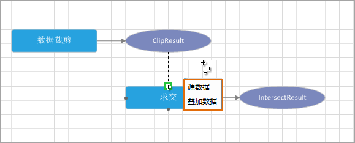
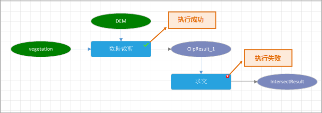

模型的构建是将一系列的工具串联起来，连接时，把一个工具的输出作为另一个工具的输入，流程化的管理和分析GIS数据。模型的构建过程可视化，构建方式简单，数据管理分析流程化、自动化，适合新老用户。

可视化建模支持的主要功能有以下几点：

  * 建模：可视化建模窗口支持模型的工具添加、删除、选中、连接、移动、缩放等操作。
  * 运行：运行单个模型节点，或者执行整个模型，并对可执行过程进行任务管理。
  * 检查：创建的工作流程是否存在错误，例如是否存在游离节点、死循环、功能无数据输入等情况。
  * 模板：将已构建模型输出为模板，通过加载模板便捷的创建工作流程。
  * 保存：构建好的工作流程可保存到工作空间中，便于后续重复使用或修改工作流程中的操作步骤及参数等。

模型的构建过程如下所述：

1. **打开模型窗口** ：在“工作空间管理器”中单击“模型”节点，右键菜单中选择“新建模型”；或在Ribbon的“可视化建模”选项卡中，单击“新建”按钮，即可打开一个模型窗口。

2. **添加数据变量** ：在“可视化建模”选项卡中，单击“变量”按钮 ，在模型窗口中适当位置点击鼠标，即可创建数据变量，如下图所示绿色椭圆即为数据变量，双击该节点可打开参数面板，设置输入数据集。 

3. **添加工具** ：在工具箱中选中工具，直接拖拽到建模窗口中即可，可以依次拖拽添加工作流程中需要的工具到建模窗口中。

4. **连接工具** ：在模型中，通过在模型工具间添加连接关系，确定工具的执行顺序，并将前一个工具的输出作为后一个工具的输入。在“可视化建模”选项卡中，点击“连接”按钮，在建模窗口上按住鼠标左键，从一个模型工具的结果节点绘制到另一个模型工具的功能节点上。两个模型工具之间，要成功进行连接，必须设置结果节点为功能节点的数据输入类型。

5. **参数设置** ：双击模型中的工具功能节点，可以打开该工具的参数面板，在参数面板中设置各个工具相关的参数。 **注意** ，工具有必选参数和可选参数，必须设置必选参数，才能保证模型的正常运行。各功能的参数说明请参见对应该能描述的文档页面。

6. **检查** ：创建好模型之后，可通过可“视化建模”选项卡中“检查”功能，检查模型中是否存在错误，例如是否存在游离节点、死循环、功能无数据输入等情况。若模型中存在错误，输出窗口会提示错误信息。 **注意** ：若未检查可视化建模模型，在运行时会自动对模型进行检查。

7. **运行** ：工作流程构建完成后，在工具条上单击运行按钮以运行整个工作流程。工作流程中的工具运行时，会自动调出“任务管理”面板。任务管理面板中，将显示每个模型工具的执行进度，以及当前的执行状态。执行成功的工具右上角，会标记为√ ；执行失败的工具右上角会标记为× 。

### 相关内容

 [可视化建模概述](WorkFlowSummarize)

 [基本词汇](WFConcepts)

 [基本操作](WFBasicOperation)

 [任务管理](WFTaskManagement)

 [模型模版](WorkFlowTemplate)

 [可视化建模实例](WorkFlowApplications)

