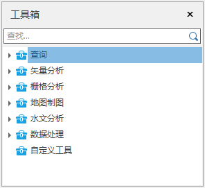
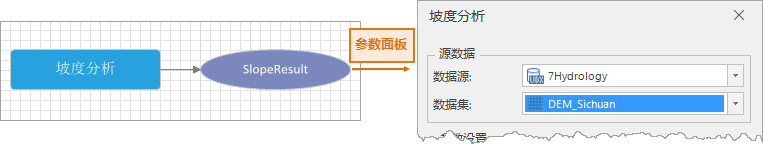
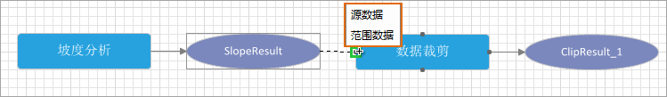
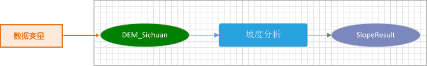
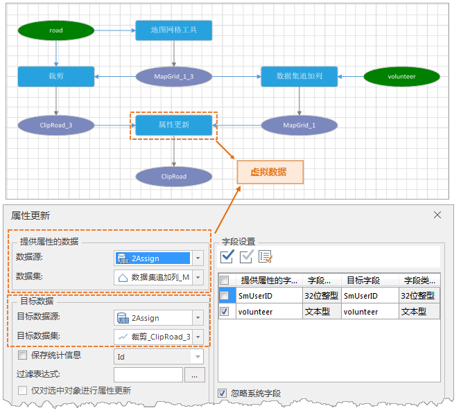

---
id: WFConcepts
title: 基本词汇
---  

**模型**

模型是一系列数据处理工具的图形表达，直观表示了可视化建模中的所有工具（功能），以及相应的连接关系。

**工具箱**

工具箱提供了各种地理数据处理、分析工具，是整个模型构成的基本单元。目前提供了6大类工具集，包括：数据处理、地图制图、空间分析、水文分析等。

工具箱中提供的工具，支持单独在后台运行，不会阻塞用户的后续操作。例如在执行坡度分析模型时，用户可以继续进行浏览数据和地图等其他交互操作。

  * **搜索** ：工具箱提供了搜索功能，用户可通过关键字搜索相关功能。了解这些工具的具体使用方法能够更好的辅助构建模型。

**工具**

工具是模型的基本构建要素，工具被添加到模型中后，需设置输入参数、输出参数和功能参数。

  * **输入参数** ：即执行功能的源数据，可通过以下三种方式设置输入参数： 

① 打开工具参数面板，在源数据中设置是数据源中的现有数据集；

② 将前一个工具的输出数据作为当前工具的输入数据，可在两个工具间添加连接进行设置；

③ 支持添加 **数据变量** 作为输入参数；

**数据变量** ：即为输入数据节点，可选择当前工作空间的任意数据集作为输入数据。创建数据变量的优势：

  * 使用数据变量可方便地将多个工具与同一数据相关联，而无需在多个工具对话框中指定该数据或值，简化了流程。 
  * 将工具参数显示为数据变量可使模型更易于查看和理解，提升了整个模型的可读性。 

  * **输出参数** ：即工具的输出结果，可打开参数设置面板进行设置。
  * **功能参数** ：工具中除去输入和输出数据以外的参数。

**连接**

连接是指将模型中的工具之间建立逻辑和参数关系，逻辑关系是指执行完前一个功能之后就执行下一个功能；参数关系是指前一个功能的结果输出数据作为后一个功能的输入数据。连接时可选择输入数据的类型，如上图所示，坡度分析结果可设置为栅格代数运算的源数据。

**虚拟数据**

虚拟数据是在建模时，该数据集还未生成，但是模型中的某个功能分析时需要用到该数据，程序支持识别此类未生成数据，将其作为虚拟数据，这样就可以很顺利的构建一个完整模型。以当前模型中，属性更新功能为例，该功能运行需要用到上一步的网格结果数据集和裁剪结果数据集，但是这两个结果数据集均未生成的，支持将这些未生成的数据作为虚拟数据，保证了模型流程的完整构建，同时也降低模型参数设置的复杂度。

  
 
  
### 相关内容

[可视化建模概述](WorkFlowSummarize)

[基本操作](WFBasicOperation)

[创建模型](CreatWorkFlow)

[任务管理](WFTaskManagement)

[模型模版](WorkFlowTemplate)

[可视化建模实例](WorkFlowApplications)

