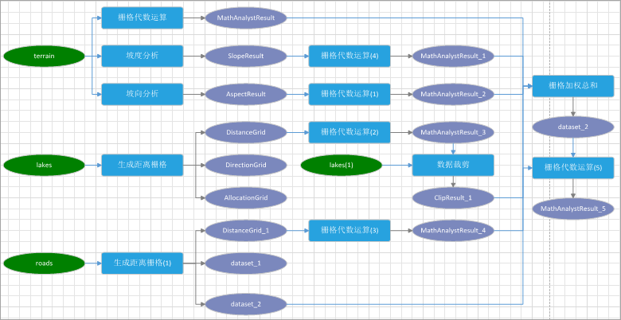
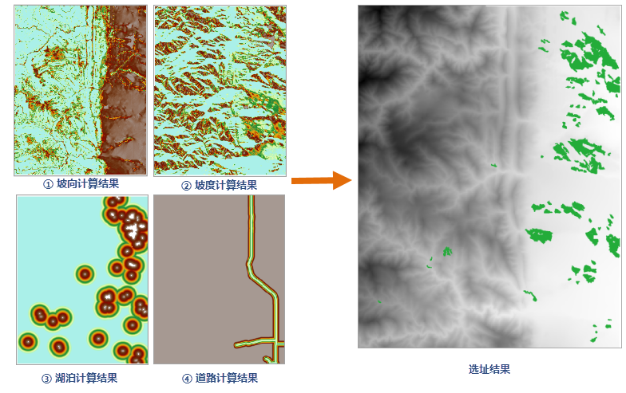

本文通过一个实例，详细介绍可视化建模的操作流程，本实例为：通过可视化建模，进行公园选址，公园选址涉及地势、高程、朝向与特殊地物的距离等多种因素，从已知DEM
数据中需要提取坡度、坡向、高程等指标，并获取湖泊、街道等栅格数据之间的关系，从而选择适宜修建公园的区域。

### 数据准备

本实例所要用的数据有：

  * 地形数据、湖泊数据、公园数据、道路数据。

**选址要求**

  * 地势：坡度小于20°；
  * 朝向：较好的朝向为东南、南和西南；
  * 高程：最理想的高程值范围是1000～1800m；
  * 与湖泊的距离：距离湖泊不超过1km；
  * 与街道距离：候选区不应该在主要街道的300m 缓冲区内。

### 可视化建模流程

  1. 打开公园选址数据源：Parklocation.udb。
  2. 单击“可视化建模”选项卡中的“新建”按钮，在打开的可视化建模窗口中，分析选址要求，需要对DEM、道路数据、湖泊数据进行分析，可先分别添加三个数据变量。
  3. **DEM 数据变量** ：依次添加栅格代数运算、坡度分析、坡向分析工具，并建立相应的连接关系，调整工具在建模窗口中的位置。
    * 高程：对 DEM 地形数据进行代数运算，将1000≤高程≤1800赋值为1，其他赋值为0，运算表达式为：Con(1000<=[terrain]>=1800,1,0)。 
    * 坡度分析：对地形数据进行坡度分析，再对坡度数据进行代数运算，将坡度小于等于20的赋值为1，大于20赋值为0，运算表达式为：Con([Slope]>=20, 1, 0)。 
    * 坡向分析：对地形数据进行坡向分析，再对坡向数据进行代数运算，选择朝向好的数据，运算表达式为：Con([AspectResult] <= 0,Con([AspectResult] < 90, Con([AspectResult] <180, Con([AspectResult] <= 270,0, (270[AspectResult])/90), ([AspectResult]90)/90), 0), 1)。 
  4. **湖泊数据** ：选址要求靠近湖泊，添加生成距离栅格工具，对湖泊数据生成距离栅格，设置栅格分析环境的分析范围为地形数据；再对分析得到的距离栅格进行代数运算，将距离小于等于1000的赋值为1，其他赋值为0，运算表达式为：Con( [LakesDis] >= 1000,1,0)。 

  5. **道路数据** ：选址要求远离街道，添加生成距离栅格工具，对道路数据生成距离栅格，再对分析得到的距离栅格进行代数运算，将距离大于等于300的赋值为1，其他赋值为0，运算表达式为：Con( [LakesDis] >= 300,1,0)。 

* 汇总多因素影响因子：添加加权求和工具，将前面进行的多因素适宜性评价结果进行汇总。
* 对加权求和后的数据进行栅格代数运算，将栅格值大于等于1的赋值为1，其他的赋值为0，栅格值为1的则表示适宜建公园，得到适宜修建公园的区域，结果图如下图所示。
 

### 相关内容

[可视化建模概述](WorkFlowSummarize)

[基本词汇](WFConcepts)

[基本操作](WFBasicOperation)

[创建模型](CreatWorkFlow)

[任务管理](WFTaskManagement)

[模型模版](WorkFlowTemplate)
