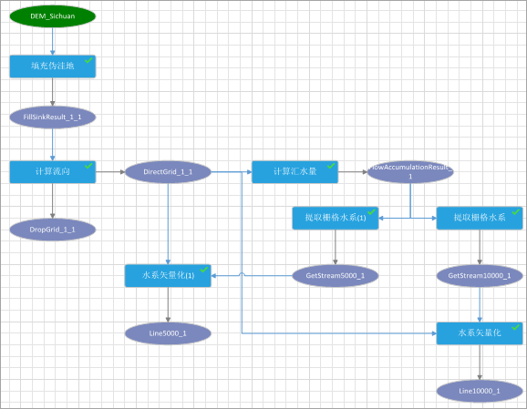
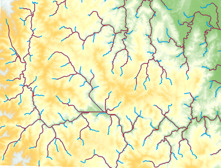

---
id: WorkFlowSummarize
title: 可视化建模概述
---  

可视化建模是指构建地理数据处理的模型，将一系列的地理数据处理工具，通过一定的逻辑关系进行连接，并自动执行。模型是一系列地理数据处理工具串联在一起的流程图，其中前一个工具的输出是后一个工具的输入。

通过可视化建模进行数据处理和分析，能够使用户高效完成工作，实现数据处理智能化、批量化、流程化。

### 主要特点

  * 构建标准化的数据处理流程：在模型中通过工具的添加、移动、连接等操作，构建标准化的数据处理流程；
  * 支持对复杂关系进行建模：工具箱中提供了丰富的工具，能够将复杂的数据处理，构建为易于理解的流程操作；
  * 一键执行，无人值守：模型运行后，即可自动根据顺序依次执行模型中的工具。
  * 实时的追踪任务执行进度及查看参数信息：通过任务管理可实时查看模型各任务执行的进度与状态，以及历史执行记录的详细信息，便于追溯模型执行情况。
  * 便捷加载、输出模版：支持模型导入与导出，模型中支持保存参数，便于模型的复用和共享。

### 示例

下图中的应用实例为：创建并执行水文分析模型，求解汇水量分别是5000和10000时的河流水系分布情况。模型会依次执行以下工具：

 

  
模型会依次执行以下工具：

  * 填充伪洼地：对 DEM 栅格数据执行填充伪洼地分析；
  * 计算流向：基于上一步的填充伪洼地结果计算流向；
  * 计算汇水量；根据流向栅格计算每个像元汇水量；
  * 提取栅格水系；通过上一步结果的会水量，提取汇水量为5000和10000时的河流水系；
  * 水系矢量化；对提取结果进行矢量化。

通过执行以上工具，得到如下结果图：蓝色线为汇水量为5000的河流水系，红色线为汇水量为10000时的河流水系。

 

  
### 相关内容

[基本词汇](WFConcepts.html)

[基本操作](WFBasicOperation.html)

[创建模型](CreatWorkFlow.html)

[任务管理](WFTaskManagement.html)

[模型模版](WorkFlowTemplate.html)

[可视化建模实例](WorkFlowApplications.html)

